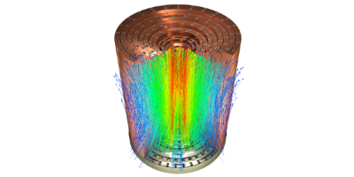
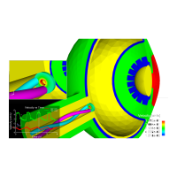

== Toolbox:: Hybridized Discontinuous Galerkin

[.columns]
=== Second order elliptic problems

[.column.small]
--
.Darcy
[latexmath]
++++
\begin{aligned}
\mathbf{j} + \mathcal{K} \nabla p &= 0 & \text{ in } \Omega \\
\nabla \cdot \mathbf{j} &= f & \text{ in } \Omega \\
p &= 0 & \text{ on } \Gamma_D  \\
\mathbf{j} \cdot \mathbf{n} &= g_N & \text{ on } \Gamma_N
\end{aligned}
++++
* stem:[p] is the potential
* stem:[\mathbf{j}] is the flux
--
[.column.small]
--
.Elasticity, stem:[d=2,3]
[latexmath.small]
++++
\begin{aligned}
\mathcal{A} \underline{\boldsymbol{\sigma}}-\underline{\boldsymbol{\epsilon}}(\boldsymbol{u})&=0 \quad \text { in } \Omega \subset \mathbb{R}^{d},\\
\nabla \cdot \underline{\boldsymbol{\sigma}}&=\boldsymbol{f} \quad \text { in } \Omega,\\
\boldsymbol{u}&=\boldsymbol{g} \text { on } \partial \Omega .
\end{aligned}
++++
* stem:[\boldsymbol{u}: \Omega \rightarrow \mathbb{R}^{3}] displacement
* stem:[\underline{\boldsymbol{\epsilon}}(\boldsymbol{u}):=\frac{1}{2}\left(\nabla \boldsymbol{u}+(\nabla \boldsymbol{u})^{\top}\right)] strain tensor
* stem:[\underline{\boldsymbol{\sigma}}: \Omega \rightarrow S] stress tensor where stem:[S] is the set of all symmetric matrices in stem:[\mathbb{R}^{d\times d}]
--

[.columns]
=== Methodology: HDG

[.column.small]
--
* *Provides* optimal approximation of both primal and flux/stress variables
latexmath:[p/\boldsymbol{u}] and latexmath:[\mathbf{j}/\underline{\boldsymbol{\sigma}}] respectively;
* *Requires* less globally coupled degrees of freedom than DG methods of
comparable accuracy;
* *Allows* local element-by-element postprocessing to obtain new
approximations with enhanced accuracy and conservation properties
--

[.column.small]
--
Some Applications

* Electrostatic
* Heat transfer
* Flow in porous media
* Elasticity and Poro-Elasticity
--

=== The integral boundary condition

[.col3-l.xx-small]
--
.Electric potential in a nanoscale floating gate nMOS
image:Figures/article/RED/electricfield_with_arrow.png[image,height=200] 
--
[.col3-c.xx-small]
--
.Magnetic field in a high field magnet (stem:[$36T$])

--
[.col3-r.xx-small]
--
.Tissue perfusion in the Lamina Cribrosa

--

[.clear.x-small]
--
.Feature: Integral Boundary Condition (IBC)
[stem.x-small]
++++
\begin{aligned}
\int_{\Gamma_{ibc}} \mathbf{j} \cdot \mathbf{n} &= I_{target}\\
p&=\text{constant but unknown}
\end{aligned}
++++
--

[.refs.xx-small]
--
* *A HDG method for elliptic problems with integral boundary condition: Theory and Applications*, Silvia Bertoluzza,Giovanna Guidoboni,Romain Hild,Daniele Prada,Christophe Prud'homme,Riccardo Sacco,Lorenzo Sala,Marcela Szopos, 2021 submitted
--

[.columns]
=== HDG Laplacian: formulation

[.column.x-small]
--
.Notations
* latexmath:[$\mathcal{T}_h$] the
collection of elements latexmath:[$K$] such that
latexmath:[$\Omega = \bigcup_{K\in \mathcal{T}_h} K$].
* latexmath:[$h:= max_{K \in \mathcal{T}_h} h_K$],
latexmath:[$\partial K$] the boundary of latexmath:[$K$] with its
measure latexmath:[$|F|$]
* latexmath:[$\mathbf{n}_{\partial K}$] is the associated unit outward
normal vector.
* The skeleton of latexmath:[$\mathcal{T}_h$] is the collection of all
the faces of latexmath:[$\mathcal{T}_h$] into the set
latexmath:[$\mathcal{F}_h$].
* latexmath:[$\mathcal{F}_h = \mathcal{F}_h^\Gamma \cup \mathcal{F}_h^0, \; \mathcal{F}_h^\Gamma = \mathcal{F}_h^D \cup \mathcal{F}_h^N \cup \mathcal{F}_h^{ibc}$]
--

[.column.x-small]
--
//Function spaces Functions belonging to latexmath:[$V_h$] and
//latexmath:[$W_h$] are, in general, fully discontinuous over
//latexmath:[$\mathcal{T}_h$], whereas functions in latexmath:[$M_h$] are
//fully discontinuous on latexmath:[$\mathcal{F}_h$] and single-valued on
//each face latexmath:[$F \in \mathcal{F}_h$] of the skeleton of
//latexmath:[$\mathcal{T}_h$].
.Function Spaces
* latexmath:[$V_h = \Pi_{K \in \mathcal{T}_h} V(K), \qquad V(K) = \left[ P_k (K) \right\]^n$]
* latexmath:[$W_h = \Pi_{K\in\mathcal{T}_h} W(K), \qquad W(K) = \left[ P_k (K) \right\]$]
* latexmath:[$\widetilde M_h = \{ \mu \in L^2(\mathcal{F}_h): \mu\rvert_F \in
          P_k(F) \; \forall F \in \mathcal{F}_h \setminus \mathcal{F}_h^{ibc}
          \},$]
* latexmath:[$M^*_h = \{ \mu \in C^0(\mathcal{F}^{ibc}_h): \mu\rvert_F \in
          P_0(F) \; \forall F \in \mathcal{F}_h^{ibc} \} \cong
          \mathbb{R}$]
* latexmath:[$M_h=\widetilde M_h \oplus M^*_h$]
--

[.columns]
=== HDG Laplacian: formulation

[.column.x-small]
--
Discrete formulation Find latexmath:[$\boldsymbol{j}_h \in V_h, \; p_h \in W_h$]
and latexmath:[$\hat{p}_h \in M_h$] such that:

[latexmath]
++++
\begin{aligned}
\sum_{K\in\mathcal{T}_h} \left[ \left( \mathcal{K}^{-1} \boldsymbol{j}^K_h, \boldsymbol{v}_h^K \right)_K - \left( p_h^K, \nabla\cdot\boldsymbol{v}_h^K \right)_K + \langle \hat{p}_h, \boldsymbol{v}_h^K \cdot {\boldsymbol{n}}_{\partial K}\rangle_{\partial K} \right] = 0 && \forall \boldsymbol{v}_h \in V_h \\
\sum_{K\in\mathcal{T}_h} \left[ -\left(\boldsymbol{j}_h^K,\nabla w_h^K \right)_K + \langle \hat{\boldsymbol{j}}_h^{\partial K}\cdot {\boldsymbol{n}}_{\partial K}, w_k^K \rangle_{\partial K} \right] = \sum_{K\in\mathcal{T}_h} \left( f, w_h^K \right)_K && \forall w_h \in W_h \\
\sum_{K\in\mathcal{T}_h} \langle \hat{\boldsymbol{j}}_h^{\partial K} \cdot {\boldsymbol{n}}_{\partial K}, \mu_h \rangle_{\partial K} = \langle g_N, \mu_h \rangle_{\Gamma_N} + I_{target} |\Gamma_{ibc}|^{-1} \langle\mu_h, 1\rangle_{\Gamma_{ibc}} && \forall \mu_h \in M_h\\
\hat{\mathbf j}_h^{\partial K} = \mathbf j_h^K + \tau_K(p_h^K - \hat{p_h}^{\partial K})\mathbf n && \forall\partial K,
\end{aligned}
++++
--

[.columns]
=== HDG Laplacian 

[.column.small]
--
.Meshes
[source.small,cpp]
----
auto mesh=loadMesh(_mesh=new Mesh<Simplex<3>>); <1>
auto complement_integral_bdy = complement(faces(mesh), <2>
  [&mesh]( auto const& e ) {
    if ( e.hasMarker() &&
         e.marker().matches(mesh->markerName("Ibc*") ) )
      return true;
    return false;
   });
auto face_mesh = createSubmesh( mesh, complement_integral_bdy); <3>
auto ibc_mesh = createSubmesh( mesh, markedfaces(mesh,"Ibc*")); <4>
----
<1> load mesh
<2> build set of non ibc facets 
<3> latexmath:[\mathcal{F}_h^{ibc}] and
<4> latexmath:[\mathcal{F}_h\setminus\mathcal{F}_h^{ibc}].
--
//[.refs.xx-small]
//--
//* Douglas N. Arnold, Franco Brezzi, Bernardo Cockburn, L. Donatella Marini:
//Unified Analysis of Discontinuous Galerkin Methods for Elliptic Problems. SIAM J. Numer. Anal. 39(5): 1749-1779 (2002)
//* *A HDG method for elliptic problems with integral boundary condition: Theory and Applications*, Silvia Bertoluzza,Giovanna Guidoboni,Romain Hild,Daniele Prada,Christophe Prud'homme,Riccardo Sacco,Lorenzo Sala,Marcela Szopos, 2021 submitted
//--

//[.columns]
//=== HDG Laplacian 

[.column.small]
--
.Function Spaces
[source.small,c++]
----
Vh_ptr_t Vh = Pdhv<OrderP>( mesh); <1>
Wh_ptr_t Wh = Pdh<OrderP>( mesh );
Mh_ptr_t Mh = Pdh<OrderP>( face_mesh );
// only one degree of freedom
Ch_ptr_t Ch = Pch<0>(ibc_mesh );
// $n$ IBC
auto ibcSpaces = product( nb_ibc, Ch); <2>
auto Xh = product( Vh, Wh, Mh. ibcSpaces  ); <3>
----
<1> create the spaces latexmath:[V_h,W_h,\tilde{M}_h] and latexmath:[M_h^*].
<2> handle arbirary number of IBCs
<3> initialize spaces and product space
[latexmath.small]
++++
\[V_h\times W_h\times \tilde{M}_h\times (M_h^*)^n\]
++++
--

[.columns]
=== HDG laplacian 

[.column.small]
--
.Construction of algebraic system
[source,cpp]
----
auto a = blockform2( Xh )
auto rhs = blockform1( Xh );

. . .
// Assembling the right hand side
rhs(1_c) += integrate(_range=elements(mesh),_expr=-f*id(w));
. . .
// Assembling the main matrix
a(0_c,0_c) += integrate(_range=elements(mesh),
                        _expr=(trans(lambda*idt(u))*id(v)) );
. . .
//$\langle \hat{p}_h\rvert_{\tilde{M}_h}, \boldsymbol{v}_h^K \cdot {\boldsymbol{n}}_{\partial K}\rangle$ $$
a(0_c,2_c) += integrate(_range=internalfaces(mesh),
         _expr=( idt(phat)*(leftface(trans(id(v))*N())+
                rightface(trans(id(v))*N()))));
----

[.column]
--
.solving and postprocessing
[source.column.x-small,c++]
----
a( 3_c, 0_c, i, 0 ) +=
   integrate( _range=markedfaces(mesh,"Ibc"),
             _expr=(trans(idt(u))*N()) * id(nu) );
auto U = Xh.element();
a.solve(_solution=U, _rhs=rhs, _name="hdg");
auto up = U(0_c); 
auto pp = U(1_c); 
auto phat = U(2_c); 
auto ip = U(3_c,0); 

// postprocessing
auto Whp = Pdh<OrderP+1>( mesh );
auto pps = product( Whp );
auto PP = pps.element();
auto ppp = PP(0_c);
auto b = blockform2( pps, solve::strategy::local, backend() );
b( 0_c, 0_c ) = integrate( _range=elements(mesh), _expr=inner(gradt(ppp),grad(ppp)));
auto ell = blockform1( pps, solve::strategy::local, backend() );
ell(0_c) = integrate( _range=elements(mesh), _expr=-lambda*grad(ppp)*idv(up));
b.solve( _solution=PP, _rhs=ell, _name="sc.post", _local=true);
ppp=PP(0_c);
ppp += -ppp.ewiseMean(P0dh)+pp.ewiseMean(P0dh);
----

[.notes]
--
* Note We can choose at the execution if we solve the problem using static
condensation or the monolithic strategy.
* Access a dynamic block of the matrix by adding the relative index. 
* create an element of the product space as usual, and access its
component in the same way.
--

[.columns]
=== Toolbox HDG

[.column.x-small]
--
* Similar to CFPDEs, except that only one equation for now 
** time dependence
** Other terms in the PDEs
** non-linear coefficients
* IBCs
** arbitrary number
** Coupling with 0D+t models using FMU 
*** time splitting approach to avoid iterating
* Extended to PoroElasticity  
* *WIP:* HHO support 
* *WIP:* Order reduction (RB and NiRB)
* *Future:* merge with CFPDEs
--
[.column.xx-small]
--
.High Field Magnets resistive / superconductors magnets
image:Figures/feelpp/applications/hifimagnets.png[image,height=300]
--

[.column.xx-small]
--
.Ocular Mathematical Virtual Simulator (OMVS)
image:Figures/feelpp/applications/OMVS-scheme-with-results.png[image,height=300]
--