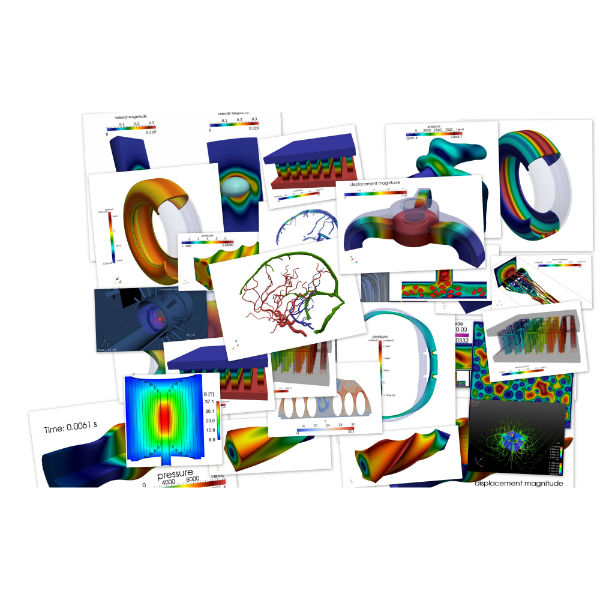

[.lightbg,background-image="Figures/feelpp/Gallery-feelpp-600x600.jpg",background-opacity="0.7"]
=== {feelpp} Core Library

[.col2]
--
//

.Laplacian
[source.xx-small,cpp]
----
auto Vh = Pch<4>( mesh, markedelements(mesh, expr("<...>")) );
auto u = Vh->element(), v = Vh->element( g, "g" );
auto l = form1( _test = Vh );
l = integrate( _range = elements( support( Vh ) ),
               _expr = f * id( v ) );
l += integrate( _range = markedfaces( support( Vh ), "Robin" ), _expr = -r_2 * id( v ) );
l += integrate( _range = markedfaces( support( Vh ), "Neumann" ), _expr = -un * id( v ) );

auto a = form2( _trial = Vh, _test = Vh );
a = integrate( _range = elements( support( Vh ) ),
               _expr = inner( k * gradt( u ), grad( v ) ) );
a += integrate( _range = markedfaces( support( Vh ), "Robin" ), _expr = r_1*idt(u)*id(v));
a += on( _range = markedfaces( support(Vh), "Dirichlet" ), _rhs=l, _element=u, _expr = g );
a.solve( _rhs = l, _solution = u );
----
--
[.col2.small,center]
--
.General Features
* A large range of **numerical methods** to solve PDEs: cG, dG, hdG, rb/mor, ... 
* 0D+t, 1D(+t), 2D(+t), 3D(+t)
* DSEL for Galerkin methods in {cpp} 
--

