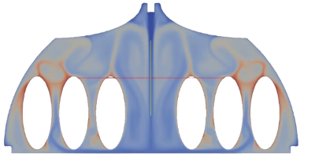
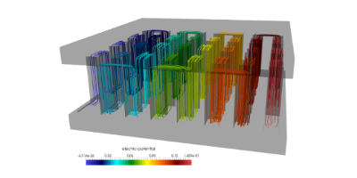

[.lightbg,background-video="videos/keyboard.mp4",background-video-loop="true",background-opacity="0.7"]
== Toolboxes :: Multiphysics

[.columns]
=== Fluid Structure Interaction
[.column]
--
video::ZNke5e7ElR4[youtube, opts="autoplay,loop,modest",height=480]
--

[.column]
--
* Partitioned methods: implicit, semi-implicit and explicit schemes
* Close fluid and structure density support
* ALE and Levelset support
* Rigid and elastic moving bodies (see MS)
--

[.columns]
=== Heat & Fluid

[.column]
--

--

[.column]
--
* Forced convection
* Natural convection
--

[.columns]
=== Thermoelectric

[.column]
--

--
[.column]
--
* Joule heating
* Seebeck/Peltier effects
* Non linear material properties
--