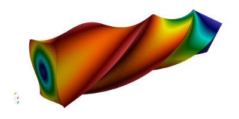
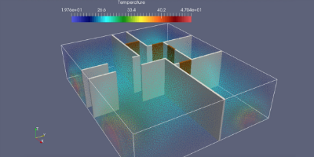

[.lightbg,background-video="videos/keyboard.mp4",background-video-loop="true",background-opacity="0.7"]
== Toolboxes

[.lightbg,background-iframe="https://www.youtube.com/embed/XOGHwCJJ3ek?rel=0&start=3&enablejsapi=1&autoplay=1&loop=1&controls=0&modestbranding=1",background-opacity="0.7"]
=== CFD

[.col2]
--
//image::Figures/feelpp/400x200/FlowAroundCylinder-400x200.png[image]
video::ZNke5e7ElR4[youtube,options="autoplay,loop",height=480]
--

[.col2.small.vcenter]
--
.Features
**   Navier-Stokes incompressible 2D, 3D
**   Newtonian and non-newtonian
**   Multi-fluid support(levelset)
**   Moving domain support(ale)
**   Rigid and elastic body interaction.
**   Pressure BC.
**   Robust stab. methods.
**   WIP Turbulence Model.
**   Various formulations (e.g. Conservative, Curl, EMAC,...)
--

[.lightbg,background-iframe="https://www.youtube.com/embed/SUAqM6liXII?rel=0&start=3&enablejsapi=1&autoplay=1&loop=1&controls=0&modestbranding=1",background-opacity="0.7"]
[.columns]
=== CSM

[.column]
--
//
video::nfi_xwR-H1k[youtube,options="autoplay,loop",height=480]
--

[.column]
--
* Linear elasticity
* Large deformations, large displacements (Hyper elasticity)
* Compressible, nearly incompressible materials
* Multi-material support
--

[.lightbg,background-iframe="https://www.youtube.com/embed/DWf3OKYT3WE?rel=0&start=3&enablejsapi=1&autoplay=1&loop=1&controls=0&modestbranding=1",background-opacity="0.9"]
[.columns.center]
=== Heat Transfer

[.column]
--
//
video::0AQM4a65Yxw[youtube,options="autoplay,loop",height=480,start=4]
--

[.column]
--
* 2D and 3D heat transfer
* High order in space and time
* Diffusion and Convection
* Robust Stab. Method
* Thermo-Electric models including Seebeck/Peltier
* Conjuguate heat transfer 
* RHT: on-going
--

