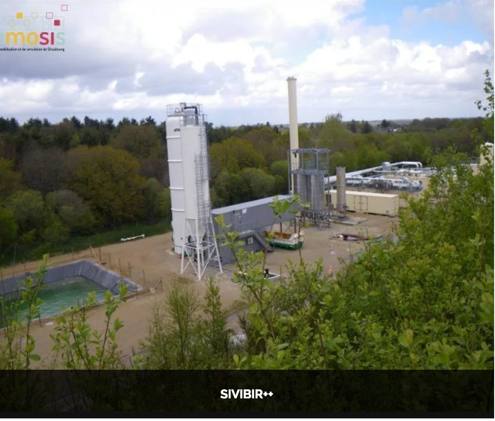
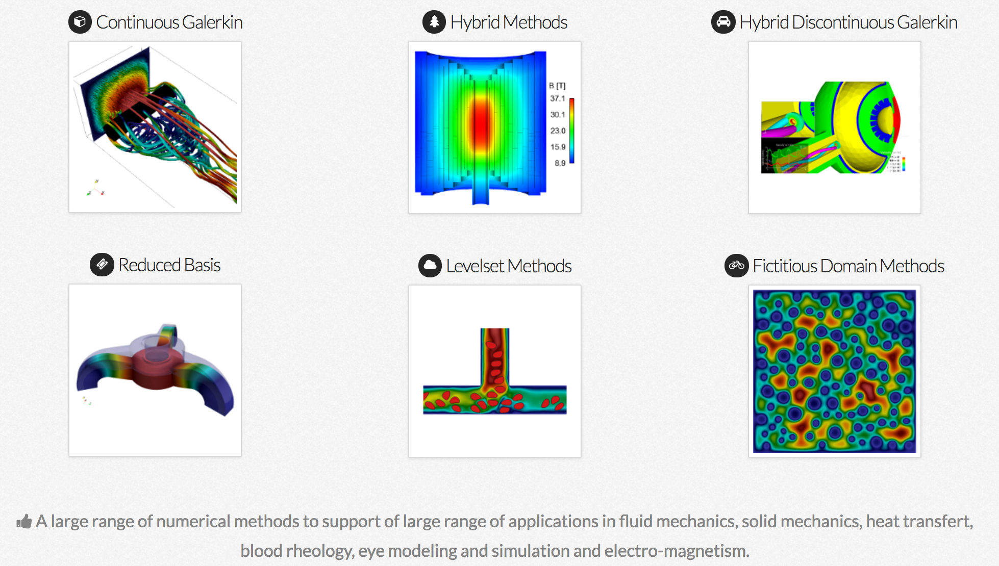

[.lightbg,background-opacity="1"] 
== What do we do with ?

What do we do with ?

[.columns]
=== Projects

[.column.stretch.xxx-small]
--
.Health(brain)
image:Figures/feelpp/applications/vivabrain.png[image,height=100]

.Health(Tumor cells)
image:Figures/feelpp/applications/hemotumpp.png[image,height=100]

.Industry (ROM,UQ)
image:Figures/feelpp/applications/chorus.png[image,height=100]

//.Plateform (EU)
//image:Figures/feelpp/applications/mso4sc.png[image,height=100]
--

[.column.stretch.xxx-small]
--
.Health(Eye/Brain)
image:Figures/feelpp/applications/eye2brain.png[image,height=100]

.Health(Tomography)
image:Figures/feelpp/applications/optical-tomography.png[image,height=100]

.Automotive(CFD,ROM)
image:Figures/feelpp/applications/po.png[image,height=100]

//
--

[.column.stretch.xxx-small]
--
.Health(Rheology)
image:Figures/feelpp/applications/blood-rheology.png[image,height=100]

.Physics(High Field Magnets)
image:Figures/feelpp/applications/hifimagnet.png[image,height=100]

.Physics(Delectometry)
image:Figures/feelpp/applications/holo3.png[image,height=100]

//.
--

[.column.stretch.xxx-small]
--
.Engineering (Buildings)
image:Figures/feelpp/applications/4fastsim-ibat.png[image,height=100]

.Health(Micro swimmers)
image:Figures/feelpp/applications/microswimmer.png[image,height=100]

.Health(Eye/Brain)
image:Figures/pngs/sala/OMVS-scheme-with-results.png[image,height=100]
--

=== Versatile

[.col2]
--
image:Figures/feelpp/Gallery-feelpp-600x600.jpg[rounded]
--
[.col2,center]
--
A large range of *numerical methods* to solve partial differential
equations: cG, dG, hdG, crb, ... in 1D, 2D and 3D
--

=== Powerful

[.col2]
--

--
[.col2.small,center]
--
Support for *high performance computing* up to thousands of cores

- Linear and non-linear problems using  *PETSc/SLEPc* 
- *InHouse* solution strategies.
- MPI based with multithreading support
- Seamless low level linear algebra and parallel
treatment hidden but customizable with API
- Hybrid computing (started)
- Flexible constructions of preconditioners (fieldsplit)
--

// === Expressive

[%notitle]
=== Architecture of the library 

image::arch.png[background,size=contain]

[.columns]
=== Mathematical language for scientific computing

[.column]
--
* to communicate between disciplines (Math, CS, Physics, Engineering...)
* to break complexity
* **Usage**: Research, R&D, Teaching
* A wide range of numerical methods, many examples and tests
--
[.column]
--

--

[.lightbg,background-video="videos/keyboard.mp4",background-video-loop="true",background-opacity="0.7"]
== Toolboxes

[.lightbg,background-iframe="https://www.youtube.com/embed/XOGHwCJJ3ek?rel=0&start=3&enablejsapi=1&autoplay=1&loop=1&controls=0&modestbranding=1",background-opacity="0.7"]
=== CFD

[.col2]
--
//image::Figures/feelpp/400x200/FlowAroundCylinder-400x200.png[image]
video::ZNke5e7ElR4[youtube,options="autoplay,loop,modest",height=480]
--

[.col2.small.vcenter]
--
.Features
**   Navier-Stokes incompressible 2D, 3D
**   Newtonian and non-newtonian
**   Multi-fluid support(levelset)
**   Moving domain support(ale)
**   Rigid and elastic body interaction.
**   Pressure BC.
**   Robust stab. methods.
**   WIP Turbulence Model.
**   Various formulations (e.g. Conservative, Curl, EMAC,...)
--

[.lightbg,background-iframe="https://www.youtube.com/embed/SUAqM6liXII?rel=0&start=3&enablejsapi=1&autoplay=1&loop=1&controls=0&modestbranding=1",background-opacity="0.7"]
[.columns]
=== CSM

[.column]
--
//image:Figures/feelpp/400x200/torsionbarNeoHookIncompT2-400x200.png[image]
video::
--

[.column]
--
* Linear elasticity
* Large deformations, large displacements (Hyper elasticity)
* Compressible, nearly incompressible materials
* Multi-material support
--

[.lightbg,background-iframe="https://www.youtube.com/embed/DWf3OKYT3WE?rel=0&start=3&enablejsapi=1&autoplay=1&loop=1&controls=0&modestbranding=1",background-opacity="1"]
[.columns]
=== Heat Transfer

[.column]
--
image:Figures/feelpp/400x200/heat-transfer-building-400x200.png[image]
--

[.column]
--
* 2D and 3D heat transfer
* High order in space and time
* Diffusion and Convection
* Robust Stab. Method
* Thermo-Electric models including Seebeck/Peltier
* Conjuguate heat transfer 
--

[.lightbg,background-video="videos/keyboard.mp4",background-video-loop="true",background-opacity="0.7"]
== Toolboxes :: PostProcessing

[.columns]
=== Common post-processing tools :

[.column]
--
* compute quantities based on expressions
* Export data/results to visualisation software
* Statistics : mean, max, min, integrals
* Norms : L2, H1, SemiH1
* Evaluation at points
* Specific toolbox outputs: eg. flow rates, stresses, fluxes...
--
[.column.x-small]
--
.PostProcessing Example
[source,json]
----
"PostProcess": { "heat" {
    "Exports": {
        "fields":["temperature","pid"]
    },
    "Measures": {
        "Normal-Heat-Flux": {
            "%1%": {
                "markers":"%1%",
                "direction":"outward",//"inward",
                "index1":["Interior_wall","Exterior_wall"] } },
        "Statistics": {
            "temperature_%1%": {
                "type":["min","max"],
                "field":"temperature",
                "markers":"%1%",
            "index1":["Interior_wall","Exterior_wall"] }} 
        },
    "tolerance":1e-1
    }
}
----
--

// ===  Specific post-processing tools adapted to the physics :
//
//* Heat : normal-heat-flux, ...
//* CFD : forces, flow rate, ...
//* CSM : von-mises-criterion, tresca-criterion, principal-stress, ...
//* ...

[.columns]
=== Toolboxes :: Setup

[.column]
--
. JSON file structure
* Models and physical properties
* Mesh
* Material properties
* Boundary/Initial conditions
* Post-processing
--

[.column]
--
.CFG file
* Dimension, polynomial and geometry order
* The algebraic setup (solvers/preconditioners of Feel++ and PETSc)
* Steady or transient with time discretization
--

[.notes]
--
By using the Feel++-toolboxes libraries, C++ developers can
modify/extend the weak formulation associated to a toolbox.
--

=== Toolboxes :: Run

[.decentlightbg.small]
--
* Each toolbox is associated to an executable which can be run in
sequential or parallel (MPI).
* Restart a simulation at specific time or expand the final time
* Output files :
** Post-processing files : CSV, EnsightGold, HDF5, VTK, ...
** Simulation Journal : .adoc, .json
** Can be automatically uploaded on data server (Girder) during the
simulation

* Choice of preconditioner : GAMG, PCD, PMM, GASM, ...
* Mesh partitioning (multiphysics with different support)
--
