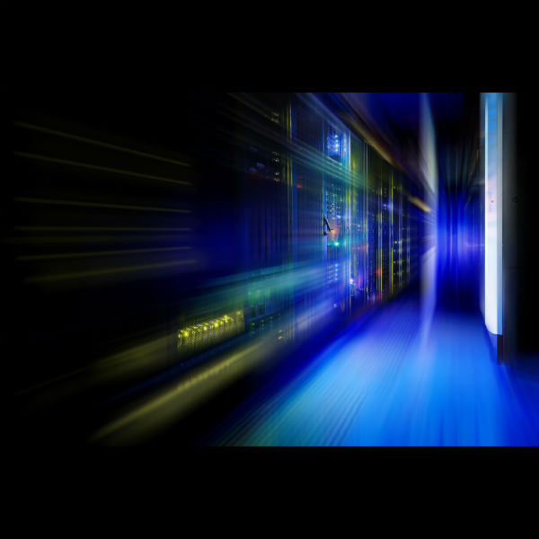
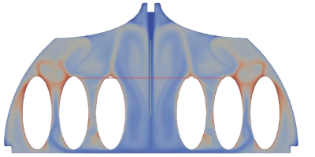
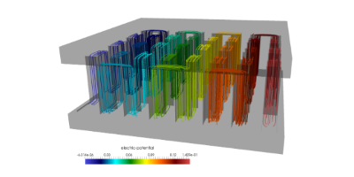
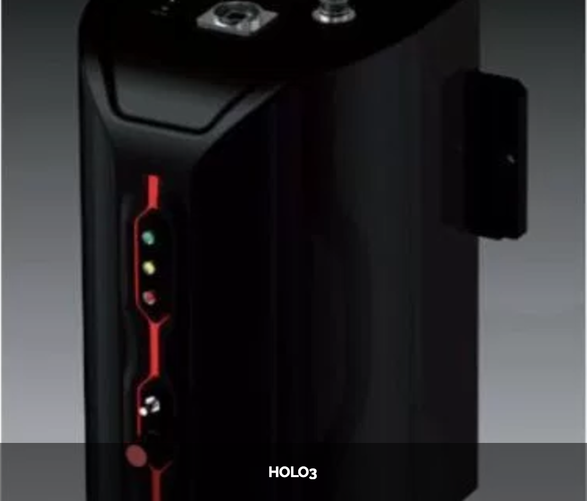

[.lightbg,background-opacity="1"] 
== What do we do with ?

What do we do with ?

=== Versatile

[.col2]
--
image:Figures/feelpp/Gallery-feelpp-600x600.jpg[rounded]
--
[.col2,center]
--
A large range of *numerical methods* to solve partial differential
equations: cG, dG, hdG, crb, ... in 1D, 2D and 3D
--

=== Powerful

[.col2]
--

--
[.col2,center]
--
Support for *high performance computing* up to thousands of cores

- linear and non-linear problems using  *PETSc/SLEPc* 
- *InHouse* solution strategies.

MPI based with multithreading support

Seamless: low level linear algebra and parallel
treatment hidden but customizable with API

--

=== Expressive

[%notitle]
=== Architecture of the library 

image::arch.png[background,size=contain]

=== Mathematical language for scientific computing

* to communicate between disciplines (Math, CS, Physics, Engineering...)
* to break complexity

Usage Scenarii: Research, R&D (``Bureau d’étude''), Teaching

A wide range of numerical methods

[.lightbg,background-video="videos/keyboard.mp4",background-video-loop="true",background-opacity="0.7"]
== Toolboxes :: Monophysics

[background-iframe="https://www.youtube.com/embed/UFwNwmQVzdU?rel=0&start=3&enablejsapi=1&autoplay=1&loop=1&controls=0&modestbranding=1"]
=== CFD

image::Figures/feelpp/400x200/FlowAroundCylinder-400x200.png[image]

* Navier-Stokes incompressible 2D, 3D
* Newtonian and non-newtonian
* Multi-fluid support(levelset)
* Moving domain support(ale)
* Rigid and elastic body interaction.
* Pressure BC.
* Robust stab. methods.
* WIP Turbulence Model.

=== CSM

image:Figures/feelpp/400x200/torsionbarNeoHookIncompT2-400x200.png[image]

* Linear elasticity
* Large deformations, large displacements (Hyper elasticity)
* Compressible, nearly incompressible materials
* Multi-material support

=== Heat Transfer

image:Figures/feelpp/400x200/heat-transfer-building-400x200.png[image] 

* 2D and 3D heat transfer
* High order in space and time
* Diffusion and Convection
* Robust Stab. Method

[.lightbg,background-video="videos/keyboard.mp4",background-video-loop="true",background-opacity="0.7"]
== Toolboxes :: Multiphysics

[.columns]
=== Fluid Structure Interaction
[.column]
--
video::ZNke5e7ElR4[youtube, opts="autoplay,loop,modest",height=480]
--

[.column]
--
* Partitioned methods: implicit, semi-implicit and explicit schemes
* Close fluid and structure density support
* ALE and Levelset support
* Rigid and elastic moving bodies (see MS)
--

[.columns]
=== Heat & Fluid

[.column]
--

--

[.column]
--
* Forced convection
* Natural convection
--

[.columns]
=== Thermoelectric

[.column]
--

--
[.column]
--
* Joule heating
* Peltier effect
* Non linear material properties
--

== Toolboxes :: PostProcessing

[.columns]
=== Common post-processing tools :

[.column]
--
* compute quantities based on expressions
* Export data/results to visualisation software
* Statistics : mean, max, min, integrals
* Norms : L2, H1, SemiH1
* Evaluation at points
--
[.column.x-small]
--
[source,json]
----
"PostProcess": { "heat" {
    "Exports": {
        "fields":["temperature","pid"]
    },
    "Measures": {
        "Normal-Heat-Flux": {
            "%1%": {
                "markers":"%1%",
                "direction":"outward",//"inward",
                "index1":["Interior_wall","Exterior_wall"] } },
        "Statistics": {
            "temperature_%1%": {
                "type":["min","max"],
                "field":"temperature",
                "markers":"%1%",
            "index1":["Interior_wall","Exterior_wall"] }} 
        },
    "tolerance":1e-1
    }
}
----
--

===  Specific post-processing tools adapted to the physics :

* Heat : normal-heat-flux, ...
* CFD : forces, flow rate, ...
* CSM : von-mises-criterion, tresca-criterion, principal-stress, ...
* ...

[.columns]
=== Toolboxes :: Setup

. JSON file
[.column]
--
* Models and physical properties
* Mesh
* Material properties
* Boundary conditions
* Post-processing
--

. CFG file
[.column]
--
* Dimension, polynomial and geometry order
* The algebraic setup (solvers/preconditioners of Feel++ and PETSc)
* Steady or transient with time discretization
--

[.notes]
--
By using the Feel++-toolboxes libraries, C++ developers can
modify/extend the weak formulation associated to a toolbox.
--

=== Toolboxes :: Run

* Each toolbox is associated to an executable which can be run in
sequential or parallel (MPI).
* Restart a simulation at specific time or expand the final time
* Output files :
** Post-processing files : CSV, EnsightGold, HDF5, VTK, ...
** Simulation Journal : .adoc, .json
** Can be automatically uploaded on data server (Girder) during the
simulation

* Choice of preconditioner : GAMG, PCD, PMM, GASM, ...
* Mesh partitioning (multiphysics with different support)

[.columns]
=== Toolboxes :: Verifications and Validations

[.column.stretch]
--
image:Figures/feelpp/applications/vivabrain.png[image,height=200]
image:Figures/feelpp/applications/hemotumpp.png[image,height=200]
--

[.column.stretch]
--
image:Figures/feelpp/applications/eye2brain.png[image,height=200]
image:Figures/feelpp/applications/optical-tomography.png[image,height=200]
--

[.column.stretch]
--
image:Figures/feelpp/applications/blood-rheology.png[image,height=200]
image:Figures/feelpp/applications/hifimagnet.png[image,height=200]
--

[.columns]
=== Projects with Feel++

[.column.stretch]
--
image:Figures/feelpp/applications/chorus.png[image,height=200]
image:Figures/feelpp/applications/po.png[image,height=200]
--

[.column]
--

--

[.column]
--
image:Figures/feelpp/applications/mso4sc.png[image,height=200]
image:Figures/feelpp/applications/gazomat.png[image,height=200]
--

[.columns]
=== Projects with Feel++

[.column]
--
image:Figures/feelpp/applications/4fastsim-ibat.png[image,height=200]
--
[.column]
--
image:Figures/feelpp/applications/microswimmer.png[image,height=200]
--
[.column]
--
image:Figures/pngs/sala/OMVS-scheme-with-results.png[image,height=200]
--

