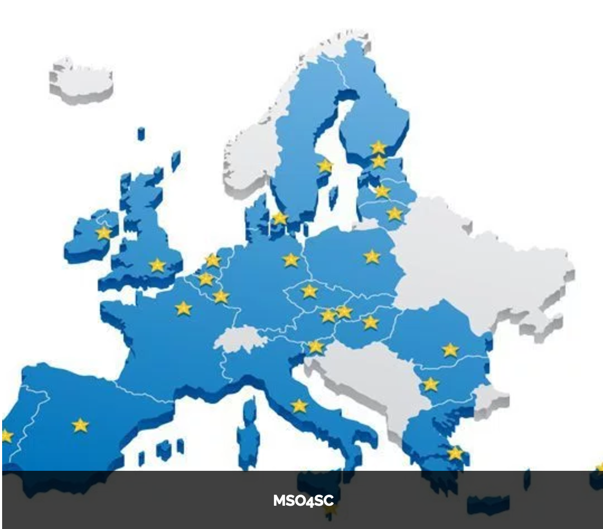
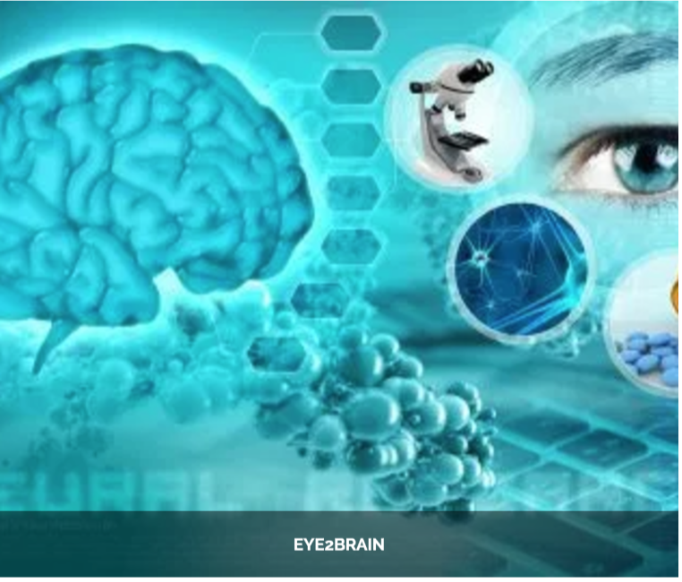
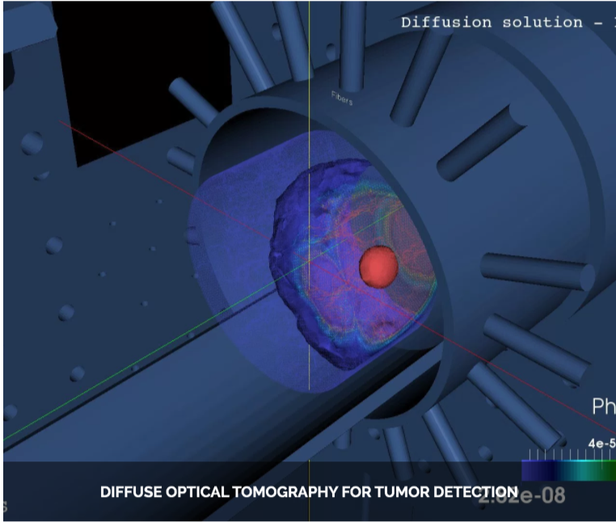
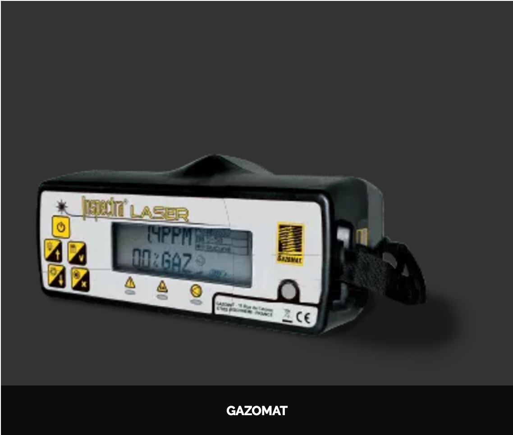
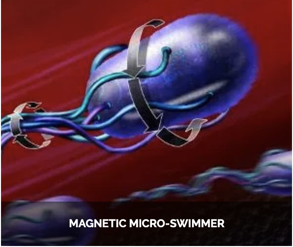

== {feelpp} Suite

[.lightbg.columns] 
=== What is {feelpp} ?

[.column.x-small]
--
.Overview
* Framework to solve problems based on ODE and PDE
* {cpp}17 (WIP {cpp}20) with a Python layer using Pybind11
* Seamless parallelism with default communicator 
* *DevOps:* CI/CD (docker + ubuntu/debian packaging)
* *Tests:* Hundreds of tests run in sequential and parallel {cpp} and Python
* *Usage:* Research, R&D, Teaching, _Services_
--

[.column.x-small.is-two-thirds]
--
//.{feelpp} Stack
image::arch.png[image,height=700]
--

//[%notitle]
//[.lightbg,background-opacity="1"] 
//=== What do we do with ?
//
//What do we do with {feelpp}?

[.columns]
=== Applications

[.column.stretch.xxx-small]
--
.Health(brain)
image:Figures/feelpp/applications/vivabrain.png[image,height=100]

.Health(Tumor cells)
image:Figures/feelpp/applications/hemotumpp.png[image,height=100]

.Industry (ROM,UQ)
image:Figures/feelpp/applications/chorus.png[image,height=100]

//.Plateform (EU)
//
--

[.column.stretch.xxx-small]
--
.Health(Eye/Brain)

.Health(Tomography)

.Automotive(CFD,ROM)
image:Figures/feelpp/applications/po.png[image,height=100]

//image:Figures/feelpp/applications/bioreactor-sivibirpp.png[image,height=100]
--

[.column.stretch.xxx-small]
--
.Health(Rheology)
image:Figures/feelpp/applications/blood-rheology.png[image,height=100]

.Physics(High Field Magnets)
image:Figures/feelpp/applications/hifimagnet.png[image,height=100]

.Physics(Delectometry)
image:Figures/feelpp/applications/holo3.png[image,height=100]

//.
--

[.column.stretch.xxx-small]
--
.Health(Micro swimmers)

.Engineering (Buildings)
image:Figures/feelpp/applications/microswimmer.png[image,height=100]

.Health(Eye/Brain)
image:Figures/feelpp/applications/OMVS-scheme-with-results.png[image,height=100]
--

include::feelpp-intro.adoc[]

include::feelpp-devs.adoc[]

//include::feelpp-toolboxes.adoc[]

include::feelpp-toolboxes-devs.adoc[]

